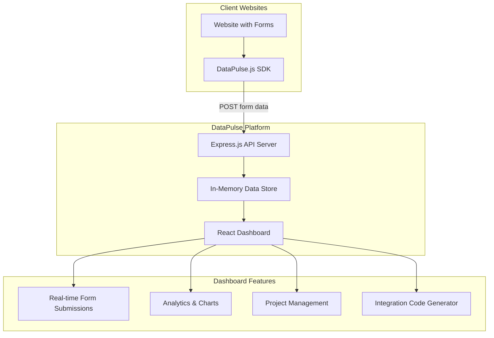

# DataPulse - Implementation Plan

A comprehensive SaaS platform that allows developers to integrate a tracking service into their websites to monitor incoming data through web forms without requiring deep technical expertise.

## Architecture Overview

---

## Components Built

### Frontend - React Dashboard

| File | Description |
|------|-------------|
| `src/index.css` | Modern design system with dark theme, glassmorphism |
| `src/pages/Landing.jsx` | Hero, features, CTA sections |
| `src/pages/Login.jsx` | Login with demo mode |
| `src/pages/Register.jsx` | Registration with benefits |
| `src/pages/Dashboard.jsx` | Stats, charts, recent activity |
| `src/pages/Projects.jsx` | Project CRUD, API keys |
| `src/pages/Submissions.jsx` | Filter, export, detail modal |
| `src/pages/Integration.jsx` | Step-by-step code generator |
| `src/components/Navbar.jsx` | Responsive navigation |
| `src/components/Sidebar.jsx` | Dashboard sidebar |

### Backend - Express.js API

| Endpoint | Method | Description |
|----------|--------|-------------|
| `/api/auth/register` | POST | User registration |
| `/api/auth/login` | POST | User login |
| `/api/projects` | GET/POST | List/Create projects |
| `/api/projects/:id` | DELETE | Delete project |
| `/api/projects/:id/key` | POST | Regenerate API key |
| `/api/track` | POST | Receive form submissions |
| `/api/submissions` | GET | Get user's submissions |

### Tracking SDK

`public/datapulse.js` - Lightweight (~2KB):
- Auto-detect all forms
- Capture submissions
- Send to DataPulse API
- Password field redaction

### Demo Website

`demo-website/index.html`:
- Contact form
- Newsletter signup
- Feedback form
- Registration form

---

## Technology Stack

| Layer | Technology |
|-------|------------|
| Frontend | React 19 + Vite |
| Styling | Vanilla CSS |
| Charts | Recharts |
| Icons | Lucide React |
| Backend | Express.js |
| Storage | In-memory (demo) |
| SDK | Vanilla JavaScript |

---

## Security Considerations

1. **API Key Authentication** - Each project gets a unique API key
2. **CORS Headers** - Configured for cross-origin requests
3. **Input Validation** - Form data sanitization
4. **Password Redaction** - Automatic in SDK

> **Note**: This is a hackathon demo using in-memory storage. For production, use a proper database and JWT authentication.
