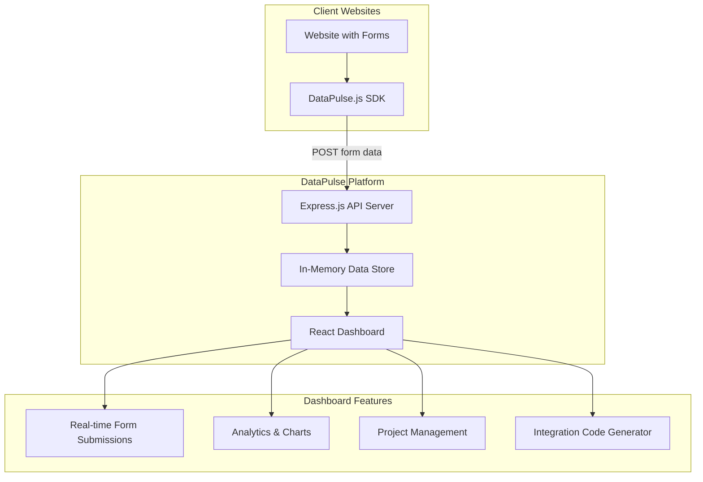

# DataPulse — Implementation Plan

> **Project:** DataPulse  
> **Version:** 1.0  
> **Last Updated:** February 2026  
> **Purpose:** Comprehensive overview of the DataPulse SaaS platform implementation

---

## Table of Contents

1. [Introduction](#1-introduction)
2. [Architecture Overview](#2-architecture-overview)
3. [Component Breakdown](#3-component-breakdown)
4. [Technology Stack](#4-technology-stack)
5. [Security Considerations](#5-security-considerations)

---

## 1. Introduction

DataPulse is a comprehensive SaaS platform that allows developers to integrate a tracking service into their websites to monitor incoming data through web forms — without requiring deep technical expertise. The platform provides a plug-and-play JavaScript SDK, a backend API for data ingestion, and a React-based dashboard for analytics and management.

---

## 2. Architecture Overview

---

## 3. Component Breakdown

### 3.1 Frontend — React Dashboard

- `src/index.css` — Modern design system with dark theme and glassmorphism
- `src/pages/Landing.jsx` — Hero section, feature highlights, call-to-action
- `src/pages/Login.jsx` — Login page with demo mode support
- `src/pages/Register.jsx` — Registration page with feature benefits
- `src/pages/Dashboard.jsx` — Statistics, charts, and recent activity feed
- `src/pages/Projects.jsx` — Project CRUD operations and API key management
- `src/pages/Submissions.jsx` — Submission filtering, export, and detail modal
- `src/pages/Integration.jsx` — Step-by-step integration code generator
- `src/components/Navbar.jsx` — Responsive top navigation
- `src/components/Sidebar.jsx` — Dashboard sidebar navigation

### 3.2 Backend — Express.js API

- **POST** `/api/auth/register` — User registration
- **POST** `/api/auth/login` — User login
- **GET / POST** `/api/projects` — List and create projects
- **DELETE** `/api/projects/:id` — Delete a project
- **POST** `/api/projects/:id/key` — Regenerate API key
- **POST** `/api/track` — Receive form submissions from client sites
- **GET** `/api/submissions` — Retrieve submissions for the authenticated user

### 3.3 Tracking SDK

**File:** `public/datapulse.js` — Lightweight (~2KB)

Capabilities:

- Automatic detection of all `<form>` elements on the page
- Capture and serialize form submissions
- Asynchronous payload delivery to the DataPulse API
- Automatic password field redaction for security

### 3.4 Demo Website

**File:** `demo-website/index.html`

Includes sample forms for testing:

- Contact form
- Newsletter signup
- Feedback form
- Registration form

---

## 4. Technology Stack

- **Frontend:** React 19 + Vite
- **Styling:** Vanilla CSS (custom design system)
- **Charts:** Recharts
- **Icons:** Lucide React
- **Backend:** Express.js
- **Storage:** In-memory (demo mode)
- **SDK:** Vanilla JavaScript

---

## 5. Security Considerations

1. **API Key Authentication** — Each project receives a unique API key for tracking authorization.
2. **CORS Headers** — The backend is configured to accept cross-origin requests from client websites.
3. **Input Validation** — Form data is sanitized before storage.
4. **Password Redaction** — The SDK automatically redacts password-type fields.

> **Note:** This is a hackathon demo using in-memory storage. For production deployment, use a persistent database (e.g., Supabase/PostgreSQL) and JWT-based authentication.
